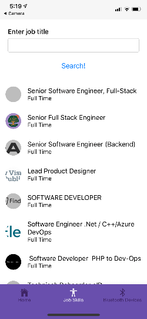

# React Native Demo

> This React Native Demo is an exercise in working with React Native and the unique aspects of mobile development. Currently, the application allows a user to search GitHub Jobs API (https://jobs.github.com/api) for jobs listings related to a search term. Those job listings are then funneled through an Open Skills API (https://github.com/workforce-data-initiative/skills-api/wiki/API-Overview) for skills related to said job. Additional features and testing will be added in future updates.

## Table of Contents

- [Installation](#installation)
- [Features](#features)
- [Challenges](#challenges)
- [Team](#team)

## Installation

Please note this application was developed using Expo and was not ejected. Reasons why will be discussed in the [Challenges](#challenges) section. To view the application, you must download Expo on your mobile device (https://expo.io/).

```shell
git clone https://github.com/Lulzasaur/React_Native_Demo.git
CD React_Native_Demo
npm install
npm start
```
Your browser or machine should pull up a QR code which you can scan with your mobile device to bring up the application.

### Clone

- Clone this repo to your local machine using `https://github.com/Lulzasaur/React_Native_Demo.git`

---

## Features

- Users can search through GitHub Jobs API and see skills needed for specific job listings. Job search titles are normalized through the Open Skills API and skills are returned using said API.

---

## Challenges

- The original scope of the project included adding Bluetooth capability for the application. While adding Bluetooth capability can be relatively simple with the correct library (see: https://github.com/Polidea/react-native-ble-plx). However, currently, Expo does not support a Bluetooth API without first detaching the Expo app (see here: https://expo.canny.io/feature-requests/p/bluetooth-api). 

- Jest does not transpile imports with jest-expo. This is currently a known issue with Jest and the current 'official' work around is to transformIgnorePatterns and add said modules to the array (see here: https://jestjs.io/docs/en/configuration.html#transformignorepatterns-array-string). While this does work for most tests, it is not a perfect solution currently for all packages.
